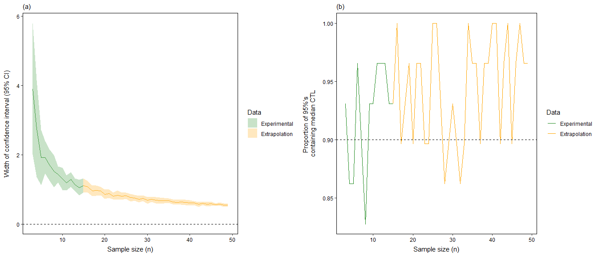

ThermalSampleR User Guide
================
Last updated 21/11/2020

### DOCUMENT CONTENTS

1.  [Installation](#installation)
2.  [Uploading Data](#uploadingdata)
3.  [Worked Example](#worked_example)
4.  [Bootstrap one group](#bootstrap_one)
5.  [Plot results for one group](#plot_one)
6.  [Bootstrap two groups](#bootstrap_two)
7.  [Plot results for two groups](#plot_two)

### Installation and Usage <a name = "installation"></a>

Install the ThermalSampleR package in R via GitHub using this line of
code:

`devtools::install_github("CJMvS/ThermalSampleR")`

Or access the GUI Shiny App version via either the online platform:

<https://clarkevansteenderen.shinyapps.io/ThermalSampleR_Shiny/>

Or GitHub through the R console:

`library(shiny)`  
`shiny::runUrl("https://github.com/CJMvS/ThermalSampleR_Shiny/archive/main.tar.gz")`

### Uploading Data <a name = "uploadingdata"></a>

Input files must be saved in .csv format, with two columns: one for the
sample group, and one for the response (e.g. Critical Thermal Limit
temperature data). For example:

| Group     | CTL\_min |
| --------- | :------: |
| Species A |    5     |
| Species A |    6     |
| Species B |    4     |
| Species B |    3     |
| Species C |    4     |
| Species C |    6     |

### Worked Example <a name = "worked_example"></a>

ThermalSampleR comes with an example data sheet, named “coreid\_data”.
The following worked example will use this as input.

``` r
library(ThermalSampleR)
coreid = ThermalSampleR::coreid_data
# if reading a local Excel .csv file, use read.csv("file_path/file_name.csv")
head(coreid)
```

    ##                          col response
    ## 1 Catorhintha schaffneri_APM        5
    ## 2 Catorhintha schaffneri_APM        5
    ## 3 Catorhintha schaffneri_APM        5
    ## 4 Catorhintha schaffneri_APM        4
    ## 5 Catorhintha schaffneri_APM        4
    ## 6 Catorhintha schaffneri_APM        4

#### Bootstrap one group <a name = "bootstrap_one"></a>

Here we use the coreid data to bootstrap for one of the two groups;
*Catorhintha schaffneri* adults (APM). We’ll set it to extrapolate to a
maximum sample size of 49, and to run 29 iterations.

``` r
bt_one = boot_one(data = coreid_data, groups_col = col, groups_which = "Catorhintha schaffneri_APM", response = response, n_max = 49, iter = 29)
```

#### Plot results for one group <a name = "plot_one"></a>

``` r
plot_one_group(x = bt_one, n_min = 3, n_max = 15, colour_exp = "forestgreen", colour_extrap = "orange", legend.position = "right", alpha_val = 0.25)
```

<!-- -->

:bulb: The alpha value changes the degree of shading on the graph. You can change the colour of the experimental data points by using the ``colour_exp`` argument, and the extrapolated data points using ``colour_extrap``.

#### Bootstrap two groups <a name = "bootstrap_two"></a>

Here we bootstrap for both groups (*Catorhintha schaffneri* adults (APM)
and larvae (NPM)), applying 29 iterations.

``` r
bt_two <- boot_two(data = coreid_data, groups_col = col, response = response, group1 = "Catorhintha schaffneri_APM", group2 = "Catorhintha schaffneri_NPM", n_max = 49, iter = 29)
```

#### Plot results for two groups <a name = "plot_two"></a>

``` r
plot_two_groups(x = bt_two, n_min = 3, n_max = 30, colour_exp = "blue", colour_extrap = "red", legend.position = "right", alpha_val = 0.25)
```

<!-- -->

:bulb: Point size and shape can be altered using ``point_size`` and ``point_shape``, respectively. 

#### Save the bootstrapped data table

Use the `write.csv()` function to save the results of the bootstrapping
analysis to a desired directory. For example:  
`write.csv(bt_one, "C:/file_path/bt_one_results.csv")`
